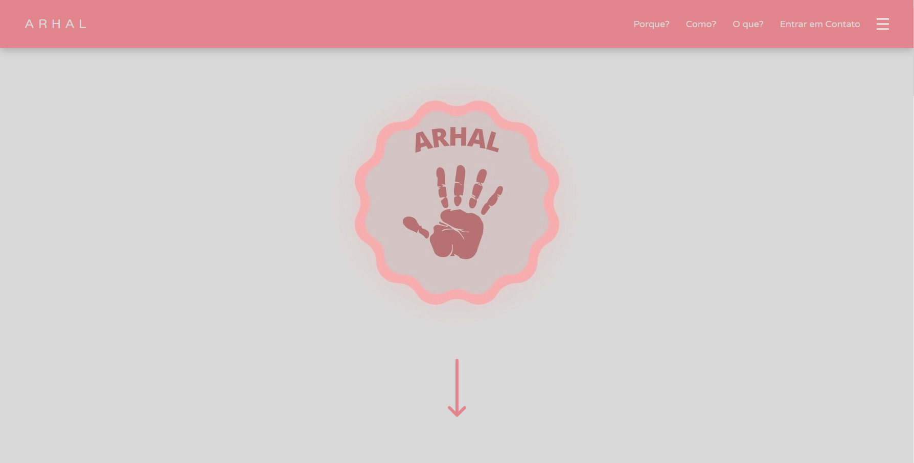
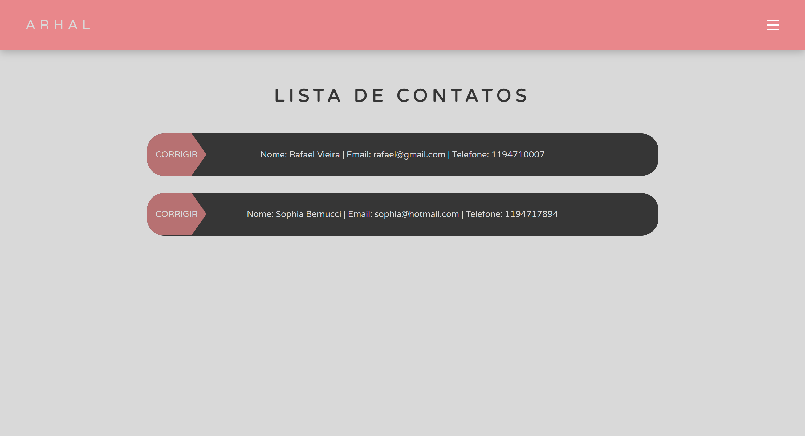

# Robotic-Hand

> In this repository, a landing page was made for a robotic hand project, which aims to improve the life of someone who has muscle hypertrophy and cannot open their hand.

## Table of contents

- [Overview](#overview)
  - [The challenge](#the-challenge)
  - [Links](#links)
  - [Screenshot](#screenshot)
- [My process](#my-process)
  - [Built with](#built-with)

## Overview

### The challenge

Users should be able to:

- Understand the Product
- Complete the Interest Form
- The Administrator can see all interested parties
- Being able to see how the website was made
- Able to switch between url's
- See the 3d object, photos and videos
- Being able to scroll the entire site without any problems

### Links

- Live Site URL: http://robotic-hand.herokuapp.com

### Screenshot

  - Desktop
  
    
    
  - Mobile
    
    

## My process

### Built with

- HTML
- CSS
- JAVASCRIPT
- PYTHON
- FLASK
- SOME LIBRARIES

[⬆ Back to the top](#robotic-hand) 
